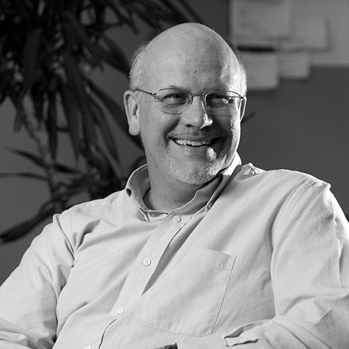
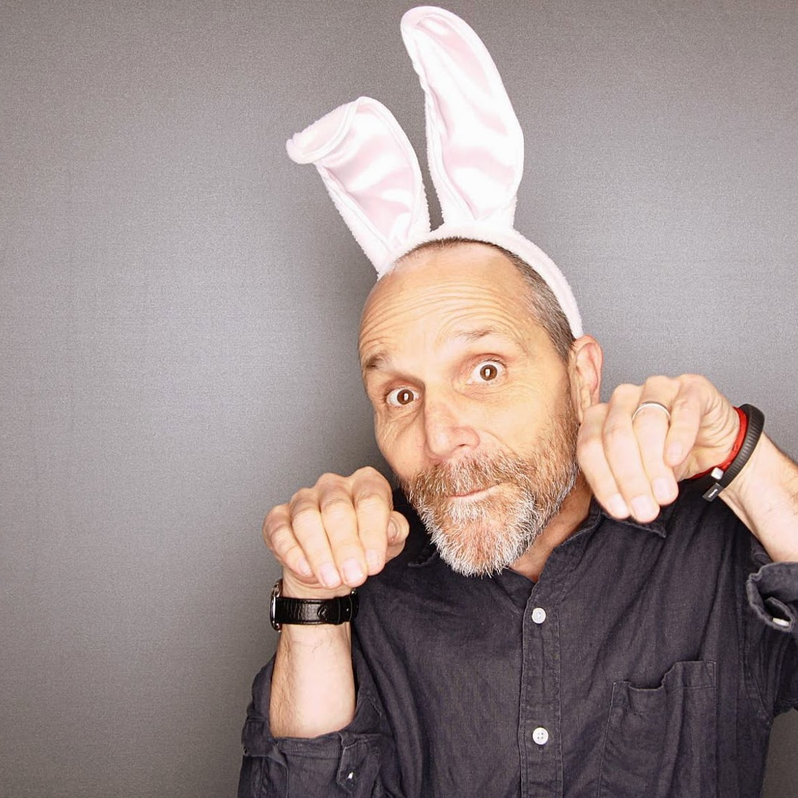
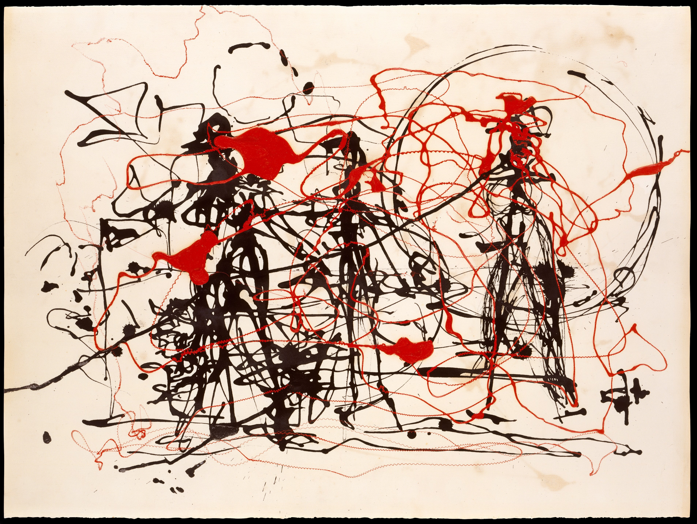
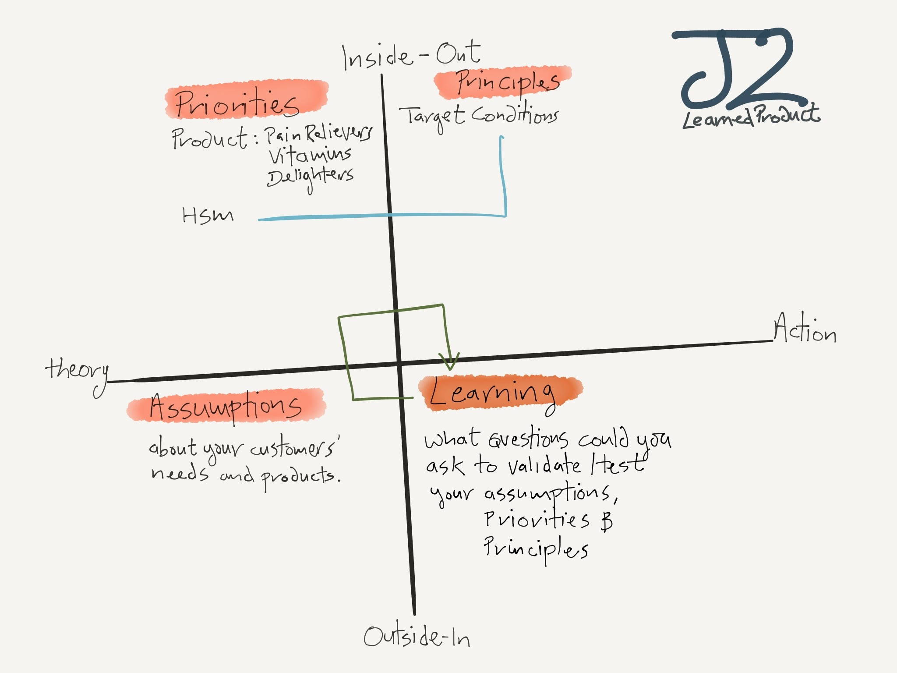
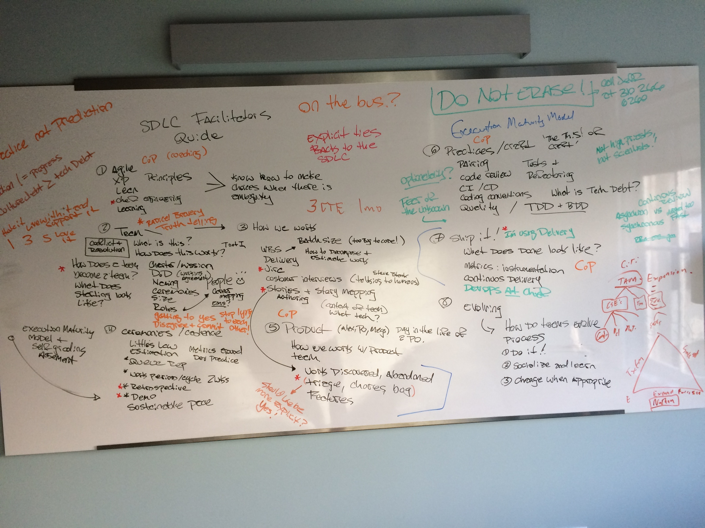

autoscale: true
footer: CHEF/SolutionsIQ CHEF SDLC, 2015
slidenumbers: true

# [fit] SDLC Facilitators Workshop

---

David Wylie
Managing Director - Solutions IQ
@davidwylie4 / dwylie@solutionsiq.com

Jeff Hackert
Director, Learning and development - CHEF
@jchackert / jhackert@chef.io / spacemonkeypants (LoL)

---

## Values, Principles, Practices

^ Short speech about relationship between principles and practices. It's to start with why, and it is exactly what is expected of us. Doing _the hard right thing_ presupposes a value system that leads to improved discernment. So be brave little buckaroos, you can do this and so can your teams!

^ Run an exercise: What principles do you see at work in your teams? How do they support what your team do? How do values and principles support practices?

---

## What will we learn?

+ Chef Engineering Values, Principles, Practices
+ Agile and XP (just enough to be dangerous)
+ Our SDLC (how it works, how to run it, how to test, how to intervene)
+ Team Ceremony facilitation
+ Something about Modernism, Pragmatism, and Organizational Change

^ what are we getting up to today?

---

## (0) Why an SDLC?

---

> Technology means ​​the knowledge of making; that is, how we create structures in the world that help us do the things that we want and need to do to thrive as human beings.
-- Yoda

---

## (1) Agile, A brief history

^ How did we get here? Why is process necessary?

---

> Prediction != Progress
-- Boba Fett

---

## (2) Team is a Verb

---

## Conway's Law

^ organizational structure is a product of communication patterns, this means that your org structure
is a product of history, not of control - This is a good thing for change agents, but keep in mind that
change agents are never the agent of change :) It's a cruel truth and the sooner you get used to it the more hepful you will become to your colleagues and to your teams.

---

> Culture Debt > Technical Debt
-- Chewbaca

---

## B = F(p,e) Lewin's law

---

## (3) How we Work

---

## IOTA (How to think about thinking about process and product)

^ IOTA is a model that helps in approaching a very short form A3 doc (Justin and I call the J2)

---

---

## (4) Ceremonies & Cadence

---

## (5) Product

^ Work with Product
+ Epics, Prioritization, Roadmap
+ Storymapping

---

## 2 product Principle

^ we are continuously delivering 2 pieces of value, customer value and kaizen improvements

---

## (6) Practices and Craft

---

## (7) Ship It!

^ Getting to done, getting to production

---

## (8) Measurement

^ Little's Law, etc.

---

## Little's Law

---

## (9) Praxis
### How Pollock chose sticks

^ How do we help teams evolve their process and practices? What is the role of the coach?

---

> “I have a general notion of what I’m about and what the results will be … With experience, it seems possible to control the flow of paint to a great extent … I deny the accident.”
-- Jackson Pollock

---

## (10) Rules for Software Radicals

^ Change is hard, don't be a dick about it. Creating and sustaining org change (ELSA)

---

## ELSA (how to create org change, for reals)

---

## Our relationship to change

---

## SDLC Epics

---

## Stories

---

## Chores, Bugs, ...?

---

> "It is conceivable to imagine a future in which this problem of generating the living structure in the world is something that you would explicitly recognize as part of your responsibility…I do think you are capable of that and I don’t think anyone else is going to do this job.”
-- Christopher Alexander​​

---

---
